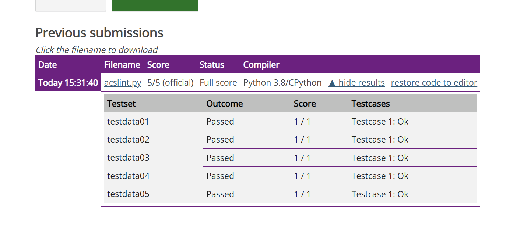

今天考了ACSL中级组第三轮，题目还是比较有意思的。是关于Rack-O游戏的模拟。

根据题目比较机翻的描述：Rack-O游戏是一种纸牌游戏，玩家需要在牌架上摆放卡牌，并且在抽取卡牌堆中的卡牌时，按照一定的规则进行替换。这次的题目就是要求我们模拟这个游戏的过程，并且计算最后的得分。

## 问题描述

在 ACSL 版的 Rack-O 游戏中，玩家会被告知卡槽数量 s，以及卡牌数量 n。每张卡牌上都有一个在 1 到 n 之间（包括 1 和 n）的专属数字。玩家将会收到 s 张卡牌，然后将这些卡牌从前至后摆放在牌架上。除此之外，玩家还会收到一叠卡牌，形成一个抽牌堆，按照卡牌叠放顺序依次抽牌。如果牌架上的卡牌未按升序排列，那么对于每一张抽到的卡牌都要按以下顺序遵循下列规则：

1. 除牌架上第一张卡牌之外，如果抽到的卡牌的数字比在牌架上某一张卡牌上的数字小 1，则用这张抽到的卡牌替换牌架上这张牌前面的卡牌。

2. 除牌架上最后一张卡牌之外，如果抽到的卡牌的数字比牌架上某一张卡牌上的数字大 1，则用这张抽到的牌替换牌架上这张牌后面的卡牌。

3. 对于牌架上任意三张在相邻卡槽中的卡牌，如果在中间位置的卡牌上的数字并不介于这三张中第一张卡牌和最后一张卡牌的数字之间，但抽到的卡牌上的数字介于其间，则用抽到的卡牌替换在中间位置的卡牌。

4. 如果抽到的卡牌比牌架上第二张卡牌小且牌架上第一张卡牌比第二张卡牌大，则用抽到的卡牌替换牌架上第一张卡牌。

5. 如果抽到的卡牌比牌架上倒数第二张卡牌大且牌架上最后一张卡牌比倒数第二张卡牌小，则用抽到的卡牌替换最后一张卡牌。

6. 否则，放弃使用抽到的卡牌，抽取下一张。

如果牌架上出现 3 张或更多张数字连续的卡牌，那么这些数字连续的卡牌每张都可以再加上5 分的奖励分。例如，如果牌架上出现数字 45、46、47，就可以额外加上 15 分的奖励分；如果牌架上出现数字 3、4、5、6，就可以额外加上 20 分的奖励分。但是，如果抽牌堆中的卡牌全部抽取完毕，但牌架上的所有卡牌未按升序排列，那么牌架值将会等于牌架上卡牌数字 递减 次数的相反数。举例来说，如果牌架上的卡牌数字序列为 40、47、20、56、15、16、17，那么数字 47 之后紧接着是较小的数字 20，数字 56 之后紧接着是较小的数字 15，这两次递减都会计入次数。并且，由于牌架上所有卡牌未按升序排列，因此 15, 16, 17 不计奖励分。所以最后牌架值等于 -2 。

| 输入数据                                    | 输出数据  |
|-------------------------------------------|-----------|
| 10 60 <br> 40 35 20 56 32 58 42 17 45 34 <br> 31 44 10 28 19 46 7 37 16 2 | 341       |
| 15 90 <br> 15 12 18 9 28 17 46 51 7 53 65 70 74 84 47 <br> 45 73 3 52 54 16 21 44 87 40 68 30 20 | 752       |
| 12 130 <br> 20 110 30 16 84 40 91 69 75 7 81 15 <br> 39 47 114 55 35 71 25 123 51 23 34 10 77 36 115 | 656       |
| 8 100 <br> 6 13 47 62 32 70 76 12 <br> 3 67 80 10 39 44 2 43 40 85 21 33 4 52 | 421       |
| 12 110 <br> 44 35 22 25 79 100 85 69 87 3 56 28 <br> 97 10 48 43 42 21 81 47 86 88 80 54 24 50 | -1        |


## 代码展示

```python
# Rank-O游戏模拟

def checkIfEnd(rank):
    # 如果rank是升序排列的，返回True
    if rank == sorted(rank):
        return True
    return False
    
def calcBonus(rank):
    bonus = 0
    consecutive_count = 1  # 记录当前连续卡牌的数量
    for i in range(1, len(rank)):
        if rank[i] == rank[i-1] + 1:
            consecutive_count += 1
        else:
            if consecutive_count >= 3:  # 如果有3张或更多连续卡牌
                bonus += consecutive_count * 5
            consecutive_count = 1  # 重置连续卡牌计数
    if consecutive_count >= 3:  # 最后一组连续卡牌的处理
        bonus += consecutive_count * 5

    # 计算牌架未按升序排列时的情况
    if sorted(rank) != rank:  # 如果牌架未按升序排列
        decrement_count = sum(1 for i in range(1, len(rank)) if rank[i] < rank[i-1])
        bonus = -decrement_count

    return bonus

s, n = map(int, input().split())
rank = list(map(int, input().split()))
heap = list(map(int, input().split()))

current_card = 0
use = 0
times = 0
while not checkIfEnd(rank) and times < n:
    times += 1
    try:
        current_card = heap.pop(0)
    except:
        break
    # print(rank, "C",current_card, "U", use)

    flag = False # 是否有满足的条件
    use = 0
    

    for i in range(len(rank)):
        if i != 0 and current_card == rank[i] - 1:
            rank[i - 1] = current_card
            flag = True
            use = 1
            break
    if flag: continue
    for i in range(len(rank)):
        if i != len(rank) - 1 and current_card == rank[i] + 1:
            rank[i + 1] = current_card
            flag = True
            use = 2
            break
    if flag: continue
    
    for i in range(len(rank)):
        if i != 0 and i != len(rank) - 1:
            if current_card > rank[i - 1] and current_card < rank[i + 1] and (rank[i] < rank[i - 1] or rank[i] > rank[i + 1]):
                rank[i] = current_card
                flag = True
                use = 3
                break
    if flag: continue
    
    for i in range(len(rank)):
        if i == 1 and current_card < rank[1] and rank[0] > rank[1]:
            rank[0] = current_card
            flag = True
            use = 4
            break
    if flag: continue
    
    for i in range(len(rank)):
        if i == len(rank) - 2 and current_card > rank[-2] and rank[-1] < rank[-2]:
            rank[-1] = current_card
            flag = True
            use = 5
            break
    if flag: continue
    

points = 0
if checkIfEnd(rank):
    points = calcBonus(rank)+sum(rank)
else:
    points = calcBonus(rank)

print(points)

```

也就是把这个代码写完了昂



过的非常干脆利索，没有任何问题。

## 总结

虽然过的干脆利落，但是我最后答完题后流连于监考会议室，没有正确摆放监考设备，被监考老师抓住了，拉到讨论室里说了一顿，我连忙展示我已经完成了题目，我也不知道最后结果如何，希望能过吧，实在不行就找组委会讲理去。